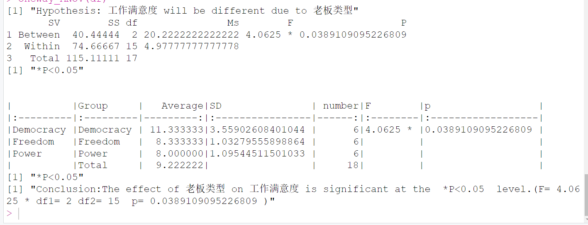

# One-way-anov
单边检验方差分析
# 目的
检验自变量和因变量是否有联系
## 单边ANOVA分析 - 组间平方和计算

假设我们有 $k$ 个组，样本量分别为 $n_1, n_2, ..., n_k$，总体均值分别为 $\mu_1, \mu_2, ..., \mu_k$。

#### 总体平均值

$$
\bar{X} = \frac{1}{N} \sum_{i=1}^{k} \sum_{j=1}^{n_i} X_{ij}
$$

其中，$N$ 是总样本量。

#### 组间平方和

组间平方和（Between-Groups Sum of Squares）计算如下：

$$
SS_{\text{Between}} = \sum_{i=1}^{k} n_i (\bar{X}_i - \bar{X})^2
$$

其中，第一个是X第 $i$ 个组的样本均值， 第二个X是总体均值。

#### 组内平方和

组内平方和（Within Sum of Squares）计算如下：

$$
SS_{\text{Within}} = \sum_{i=1}^{k} \sum_{j=1}^{n_i} (X_{ij} - \bar{X}_i)^2
$$

### 组间均方（MSBetween）与组内均方(MSWithin)

组间与组内均方过程如下：

$$
df_{\text{Between}} = k - 1
$$

$$
df_{\text{Within}} = N - k
$$

$$
MS_{\text{Between}} = \frac{SS_{\text{Between}}}{df_{\text{Between}}}
$$

$$
MS_{\text{Within}} = \frac{SS_{\text{Within}}}{df_{\text{Within}}}
$$

#### 单边ANOVA F 统计量

单边ANOVA的 F 统计量计算如下：

$$
F = \frac{MS_{\text{Between}}}{MS_{\text{Within}}}
$$

#### 单边ANOVA P 统计量(R语言)

$$
P_{\text{value}} = 1 - CDF_{}(F, df_{\text{Between}}, df_{\text{Within}})
$$

#### 决策规则

根据计算得到的 F 统计量和临界值，我们可以进行假设检验，判断是否拒绝原假设。

## R运行结果

##### PS：每一个组的组内元素个数一定要相同，如果不同则会NAN。需要元素个数不同的情况时，请参考 R语言的Welch's t-test
